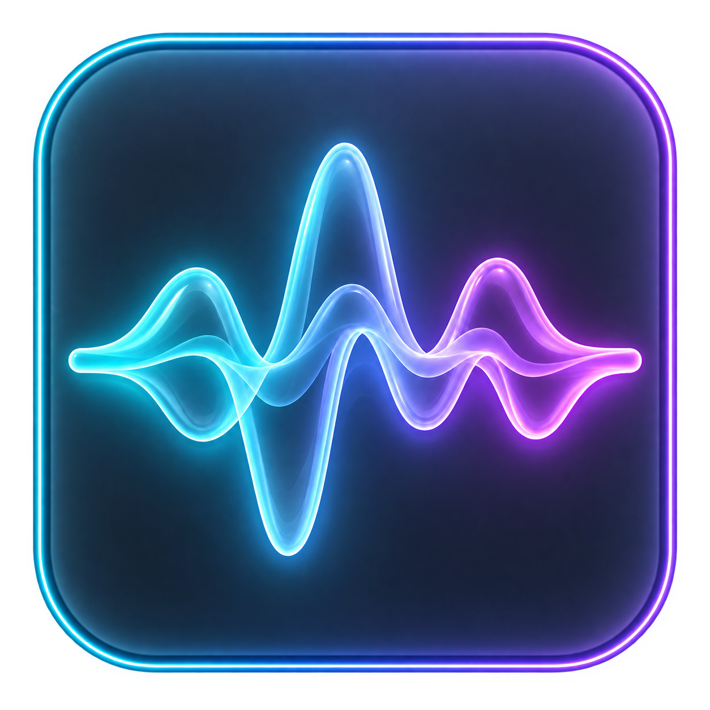
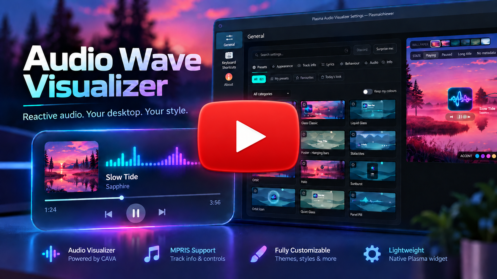
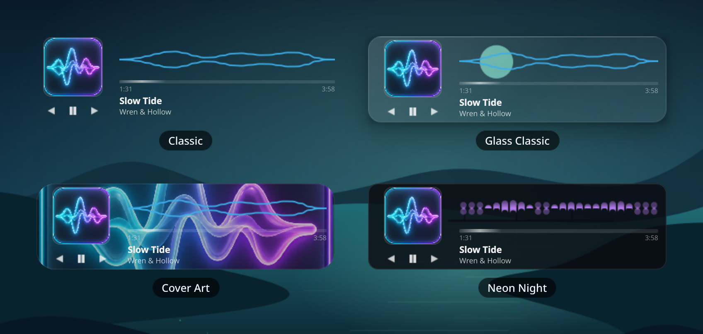
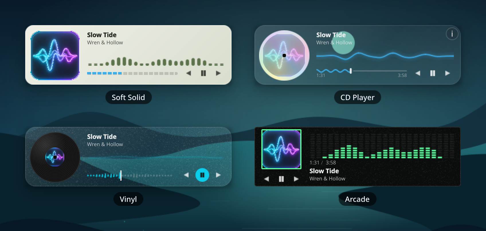
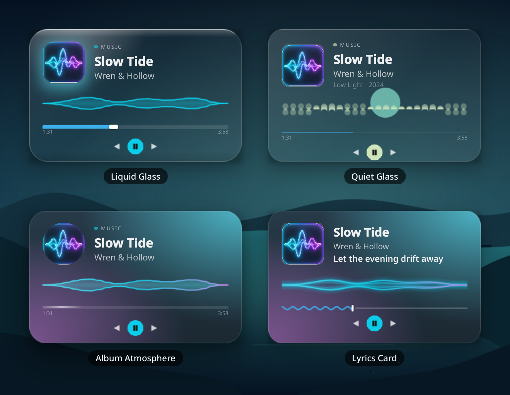
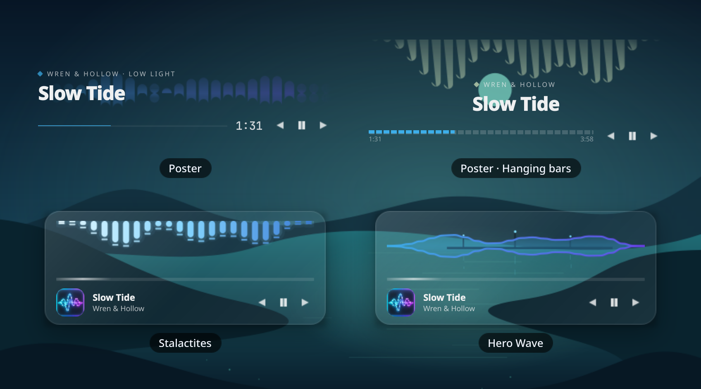
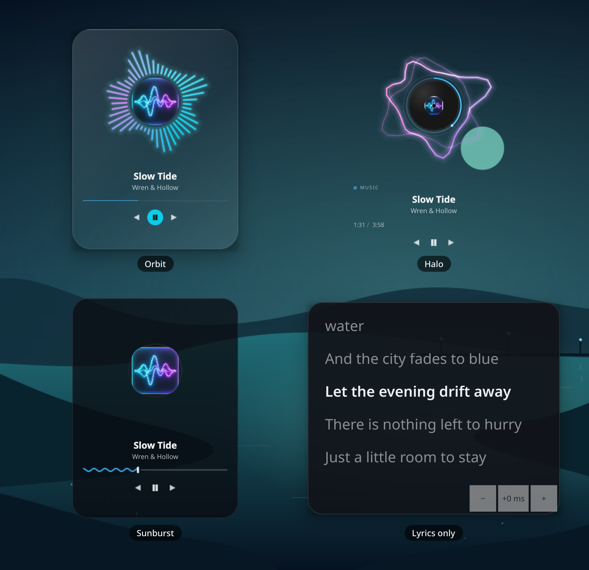
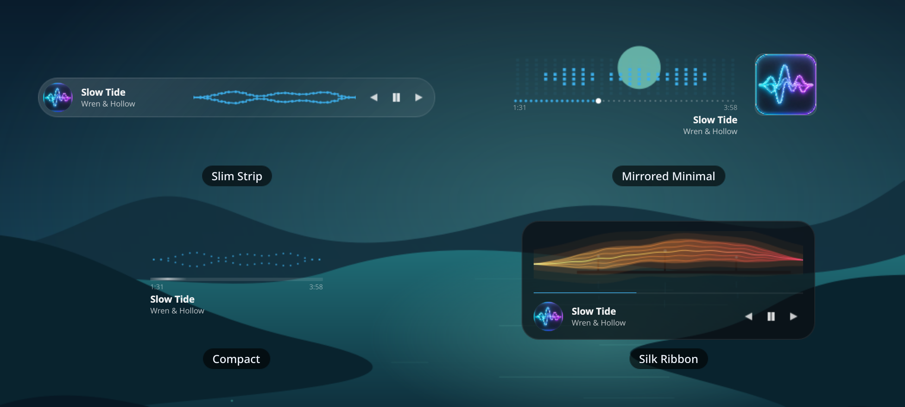
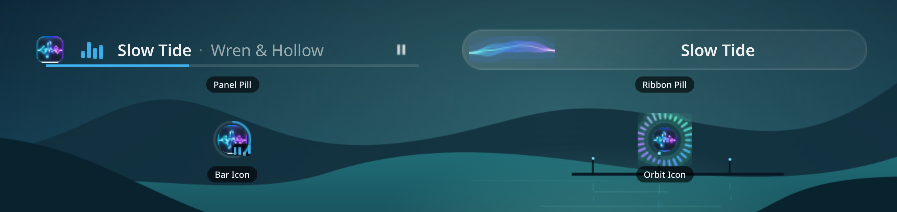
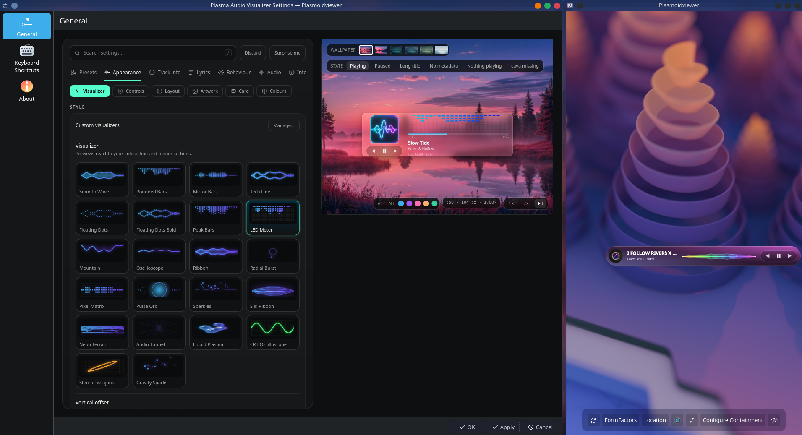

<p align="center">
  
</p>

<h1 align="center">Plasma Audio Wave Visualizer</h1>


<p align="center">
  <a href="https://muddyblack.github.io/audio-wave-visualizer/">
    
  </a>
  <a href="https://www.opendesktop.org/p/2359422/">
    
  </a>
  <a href="docs/gallery.md">
    
  </a>
</p>

<p align="center">
  
  <a href="LICENSE">
    
  </a>
  <a href="https://www.opendesktop.org/p/2359422/">
    
  </a>
  <a href="https://github.com/Muddyblack/audio-wave-visualizer/releases">
    
  </a>
  
</p>

<p align="center">
  <a href="#features">Features</a> ·
  <a href="#gallery">Gallery</a> ·
  <a href="#make-it-yours">Settings Studio</a> ·
  <a href="#requirements">Requirements</a> ·
  <a href="#install">Install</a> ·
  <a href="#how-it-works">How it works</a> ·
  <a href="#support">Support</a>
</p>

<p align="center">
  
</p>

The widget follows system audio with [cava][cava] and shows album artwork, track information, and playback controls from MPRIS players. Choose a ready-made look or tune one in the built-in settings studio.

[](https://youtu.be/ytHqeP4cBgA)

## Features

- **Dozens of ready-made presets:** Choose from cards, artwork backgrounds, posters, compact strips, panel icons, and more.
- **Many audio visualizers:** Waves, bars, particles, rings, and other styles react to system audio captured by [cava][cava].
- **Live settings studio:** Preview changes as you customize layouts, colors, visualizers, progress bars, artwork, and motion.
- **Make and share presets:** Save your own looks and exchange them as JSON with the Plasma, Quickshell, and browser studios.
- **Custom QML styles:** Import your own visualizers and progress bars from trusted local QML files.
- **Album art and track details:** Show cover art, title, artist, playback time, and an optional artwork backdrop.
- **Playback controls:** Play, pause, skip tracks, and seek through MPRIS players when supported.
- **Lyrics and karaoke:** Show a synced line on the card or switch to a lyrics-only view, with local files and optional online lookup.
- **Plasma and Hyprland:** Use the widget on KDE Plasma 6 or with Quickshell on Hyprland.

## Gallery

Real captures of the actual QML widget with sample playback. The gallery has [all 28 presets](docs/gallery.md).

<details open>
  <summary><b>Cards</b></summary>
  <br/>
  <p align="center">
    
  </p>
</details>

<details>
  <summary><b>Surfaces & Players</b></summary>
  <br/>
  <p align="center">
    
  </p>
</details>

<details>
  <summary><b>Stacked Glass</b></summary>
  <br/>
  <p align="center">
    
  </p>
</details>

<details>
  <summary><b>Posters & Heroes</b></summary>
  <br/>
  <p align="center">
    
  </p>
</details>

<details>
  <summary><b>Orbits & Lyrics</b></summary>
  <br/>
  <p align="center">
    
  </p>
</details>

<details>
  <summary><b>Slim & Minimal</b></summary>
  <br/>
  <p align="center">
    
  </p>
</details>

<details>
  <summary><b>Panel Layouts</b></summary>
  <br/>
  <p align="center">
    
  </p>
</details>

## Make it yours

Pick from many visualizers, change the layout and colours, add lyrics, and preview changes as you go. You can save your own presets and share them as JSON between the widget and the [browser studio](https://muddyblack.github.io/audio-wave-visualizer/).

<p align="center">
  
</p>

The studio is built into both the Plasma and Quickshell settings. The browser version lets you explore the same looks before installing. See [how preset sharing works](docs/sharing-presets.md).

## Requirements

- KDE Plasma **6.0+** (or Quickshell for Hyprland)
- [`cava`][cava] — the audio bar generator
- A running PipeWire or PulseAudio server (the widget auto-detects which one cava can capture from)
- `flock` (from `util-linux`) and `pkill` (from `procps`) — standard on virtually every Linux distro

[cava]: https://github.com/karlstav/cava

## Install

Full setup options and configuration details are in the [installation guide](docs/installation.md).

### KDE Plasma

<details open>
  <summary><b>Manual (any distro)</b></summary>

```bash
git clone https://github.com/Muddyblack/audio-wave-visualizer.git
cd audio-wave-visualizer
kpackagetool6 -t Plasma/Applet -i package
# or, to update an existing install:
kpackagetool6 -t Plasma/Applet -u package
```

Then add the widget from Plasma's **Add Widgets** panel.

To remove:

```bash
kpackagetool6 -t Plasma/Applet -r org.muddyblack.plasmaAudioVisualizer
```

</details>

<details>
  <summary><b>NixOS (flake)</b></summary>

```nix
# flake.nix
{
  inputs.audio-wave.url = "github:Muddyblack/audio-wave-visualizer";

  outputs = { self, nixpkgs, audio-wave, ... }: {
    nixosConfigurations.mybox = nixpkgs.lib.nixosSystem {
      modules = [
        ({ pkgs, ... }: {
          environment.systemPackages = [
            audio-wave.packages.${pkgs.system}.default
            pkgs.cava
          ];
        })
      ];
    };
  }
}
```

</details>

<details>
  <summary><b>Package as <code>.plasmoid</code> (for the KDE Store)</b></summary>

```bash
make pack
# produces plasma-audio-visualizer-<version>.plasmoid
```

</details>

### Hyprland / Quickshell

From this checkout, run:

```bash
make view-hyprland
```

The widget appears on your desktop. **Right-click it for Settings** and press **Ctrl+C** in the terminal to stop it. The launcher also works alongside Caelestia. See the [installation guide](docs/installation.md#hyprland--quickshell) for login startup, monitor placement, NixOS, and settings access when the widget is hidden.

### Windows (working, not yet tested on real Windows)

A PySide6-based overlay app that renders the same visualizer, with WASAPI
loopback capture in place of cava — see [docs/windows.md](docs/windows.md) for
how it is hosted, how to run it (`make run-windows`) and exactly what has and
has not been verified. There is no settings UI on Windows yet, and the
always-on-bottom window behaviour has only been reasoned about, not run on a
Windows machine. Microsoft Store distribution is still planned, not built.

## How it works

For a detailed explanation of the architecture and data flow, see the [Architecture Documentation](docs/workflow.md).

In short: a small shell helper (`feeder.sh`) runs `cava` in the background and writes each changed frame to `$XDG_RUNTIME_DIR/audio-wave-widget/`. The QML side reads it in-process at the configured frame rate, drops to 2 FPS after a few seconds of silence, and stops polling while the widget is hidden.

Waveforms and Orbit rings use bounded fragment-shader families on supported scene graphs, with Canvas fallbacks for software sessions. Particle state advances on the audio clock. Software covers use a static crop/mask fallback. After editing a shader, run `make shaders`.

Regression tests (synthetic audio, no desktop or sound server needed): `nix develop --command python3 tests/run.py`.

Check Python lint and formatting with `make lint-python`; apply formatting with `make format-python`. Ruff is also available in `nix develop`, or directly through `nix run .#ruff -- check .` and `nix run .#ruff -- format .`. The Ruff workflow runs both checks on pull requests and pushes, using the version pinned by `flake.lock`.

## Help and project docs

- [Installation, configuration, and troubleshooting](docs/installation.md)
- [Full preset gallery](docs/gallery.md)
- [Lyrics and karaoke](docs/lyrics.md)
- [Custom visualizers](docs/custom-visualizers.md)
- [Architecture and development workflow](docs/workflow.md)

## Support

If you enjoyed it feel free to show appreciation with a github star or some coin :)

<p align="center">
  <a href="https://github.com/sponsors/muddyblack">
    
  </a>
  <a href="https://ko-fi.com/muddyblack">
    
  </a>
  <a href="https://buymeacoffee.com/muddyblack">
    
  </a>
</p>

## Credits

- [cava][cava] provides audio capture for the visualizers.
- [LRCLIB](https://lrclib.net/) provides optional synced lyrics.
- [lumaribbon](https://github.com/Lucenx9/lumaribbon) inspired visual ideas and studio concepts.

Thanks to the creators and contributors of these projects. This project is licensed under [GPL-3.0-or-later](LICENSE).
