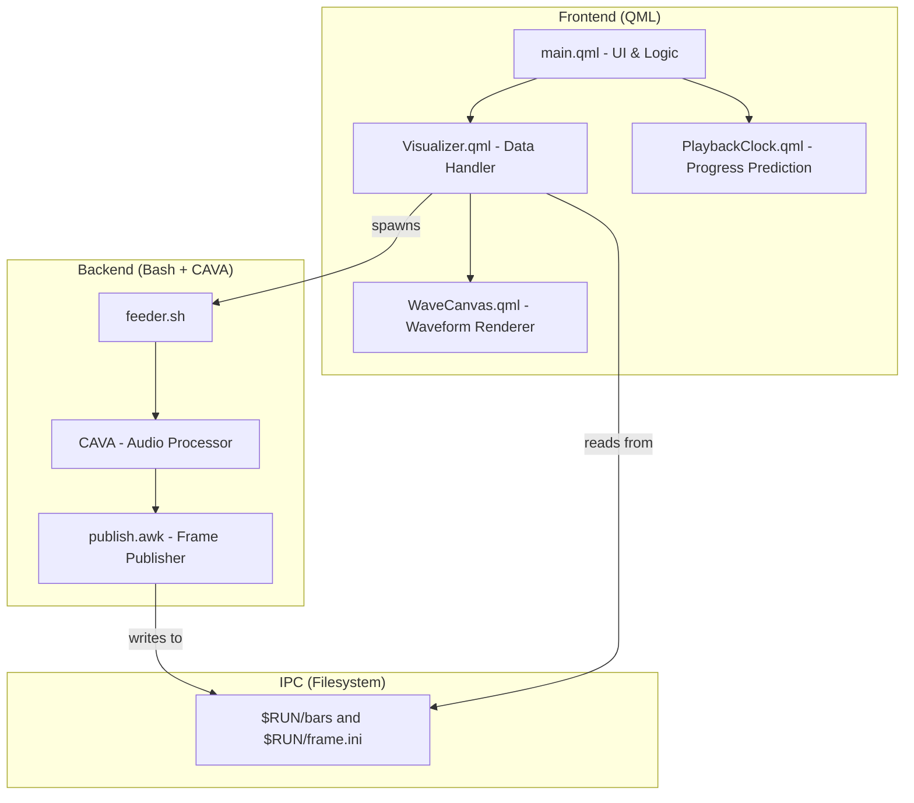

# Widget Workflow & Architecture

## Component Overview

The widget is split into three main layers: the **QML Frontend**, the **IPC Layer**, and the **Audio Backend**.



## Data Flow

The following sequence diagram shows how audio data moves from the system to your screen in real-time.

```mermaid
sequenceDiagram
    participant OS as System Audio (Pulse/Pipewire)
    participant CAVA as CAVA (via feeder.sh)
    participant FS as Runtime Directory
    participant QML as Visualizer.qml
    participant Canvas as WaveCanvas.qml

    Note over QML, CAVA: 1. Initialization
    QML->>CAVA: Spawns feeder.sh (30s heartbeat, flock prevents duplicates)
    CAVA->>CAVA: Opens lock file & starts CAVA

    Note over OS, Canvas: 2. Real-time Processing Loop
    loop Continuous
        OS->>CAVA: Raw Audio Stream
        CAVA->>CAVA: FFT & Bar calculation
        CAVA->>FS: Writes changed frames to $RUN/bars and $RUN/frame.ini; unchanged frames refresh the timestamp once per second
    end

    loop Configured frame rate while visible, 2 FPS after 3s of silence
        QML->>FS: Reads $RUN/frame.ini in-process (QSettings, no process per frame)
        FS-->>QML: Quoted string of bar values
        QML->>QML: Parses and smooths toward the new frame
        QML->>Canvas: Triggers onBarsChanged only when bar values change
        Canvas->>Canvas: Repaints the selected style
    end
```

## Detailed Process breakdown

### 1. The Feeder (`feeder.sh`)
The feeder script acts as a bridge. It uses `cava` to process system audio and outputs raw data. It ensures only one instance of CAVA is running by using `flock`. `$RUN` is `${XDG_RUNTIME_DIR:-/tmp}/audio-wave-widget`.

`bars` keeps its original semicolon format for installed widgets. `frame.ini` holds
`t=<Unix time in seconds>`, `v="<semicolon-separated bars>"` and `protocol=2` for
in-process QSettings reads; quoting keeps the payload a single string. Older
comma-separated INI frames are still accepted. Changed frames are written
immediately; identical frames leave `bars` untouched and refresh `frame.ini` once per
second, so the reader can tell a quiet feeder from a dead one. If the INI file is
missing or its timestamp is at least two seconds old, the reader falls back to the
original `bars` file. This lets old and new widgets share a feeder without forcing a
restart on startup.

Bash handles the first frame (probing and status), then hands the rest of cava's
stream to `publish.awk`: Bash's `read` costs a syscall per byte on a pipe, awk reads
in blocks. Only an awk with `systime()` is used, and mawk, the default on
Debian/Ubuntu, runs with `-W interactive`, because otherwise it waits for a full read
buffer before handling a line. Without a usable awk (e.g. one-true-awk) the Bash loop
keeps publishing.

It also **probes input backends**. cava is compiled with a fixed set of them and distros do
not agree on which ones, so a hardcoded `method = pipewire` silently produces nothing on a
build without PipeWire support, or on a machine where the sound server is not reachable.
With the input method left on `auto` the feeder tries `pipewire`, `pulse`, then `alsa`, and
keeps the first one that emits a frame within `PROBE_TIMEOUT` seconds (cava emits frames
continuously even in silence, so "no output at all" is a reliable failure signal). The
winner is cached in `$RUN/input-method` so restarts skip the probe.

Status and diagnostics files make failures visible:

| File | Contents |
|---|---|
| `$RUN/status` | `ok <method>`, `probing <method>`, or `error <code> [detail]` |
| `$RUN/status.ini` | The same line as a quoted `v` value, for in-process reads |
| `$RUN/publisher` | Which reader publishes frames: `awk`, `awk -W interactive`, or `bash` |
| `$RUN/cava.log` | stderr of cava and the publisher, for when capture fails |

Error codes: `no-cava` (binary missing), `no-backend` (every candidate failed),
`cava-exited` (a working backend died — usually transient).

`no-cava` carries a third token naming the detected package manager (`apt-get`, `pacman`,
`nix-env`, …) so the widget can print the exact install command rather than "install cava".
Detection is by binary presence, not the `/etc/os-release` ID: derivatives keep their
parent's package manager but change the ID.

### 2. The Data Handler (`Visualizer.qml`)
This component is responsible for:
- Starting the feeder script.
- Reading frames while the widget is shown; `main.qml` deactivates it while the widget
  is hidden (no player and "always visible" off).
- Following actual audio independently of MPRIS playback state. Capture stays
  available so audio from apps without media controls can wake the wave.
- Polling at 2 FPS after sustained silence or missing data, and snapping settled
  values to their target; repeated settled frames do not emit `barsChanged` or repaint
  the canvas.
- Reading status every 4s and exposing `backendFailed` / `backendMessage` /
  `backendHint`, which `main.qml` renders in place of the waveform. A `cava-exited` state
  triggers an immediate respawn (the `flock` makes a redundant spawn a no-op) and is only
  reported to the user if it persists for ~12s. While protocol-2 frames are fresh, status
  comes from `status.ini` in-process; otherwise from `status` via `cat`. Frame polling
  pauses while the backend has failed, and the status checks keep running to recover.
- Respawning the feeder every 30s unless fresh frames show it is alive.
- Restarting the feeder when settings change, once per burst of changes (100ms): it
  stops the feeder by the PID in `$RUN/feeder.pid` (and cava, for older feeders), waits
  for the `flock` to be released, then spawns the new one. Stopping only cava is not
  enough: during a backend probe the feeder would move on to the next backend with the
  old settings.
- Cleaning up the feeder process when the widget is destroyed.

### 3. The Renderer (`WaveCanvas.qml`)
The UI uses the HTML5-like `Canvas` API in QML to draw the selected visualizer from
the configured number of frequency bars. The idle line follows `vis.hasAudio`;
MPRIS only controls track information and media controls. Colors, edge tapers and
fill gradients are recomputed only when their inputs change, and the canvas skips
repaints while hidden, idle, or showing a backend error.

`PlaybackClock.qml` predicts the playback position between MPRIS updates, since MPRIS
does not signal position during normal playback. Its 50ms tick only runs while the
progress bar is visible and playing, and a bar that becomes visible catches up at
once. The waveform seekbar repaints when its playhead crosses a pixel or
appears/disappears at an endpoint.

## Regression checks

Run `nix develop --command python3 tests/run.py`, or `python3 tests/run.py` with Qt 6
`qmltestrunner` on `PATH`. The tests run the real feeder with a synthetic cava in an
isolated runtime directory, once for each awk found on `PATH` (gawk, mawk, busybox,
nawk) plus an unusable one, and the actual QML components with a stub executable
engine. They cover changing and repeated frames, the heartbeat, legacy compatibility
and the stale-file fallback, silence settling and wakeup, joining an existing feeder,
backend fallthrough and failure recovery, coalesced settings, a restart during a
backend probe, all six canvas styles, and playback prediction. They do not access the
desktop or sound server. CI runs them in `.github/workflows/tests.yml`.
