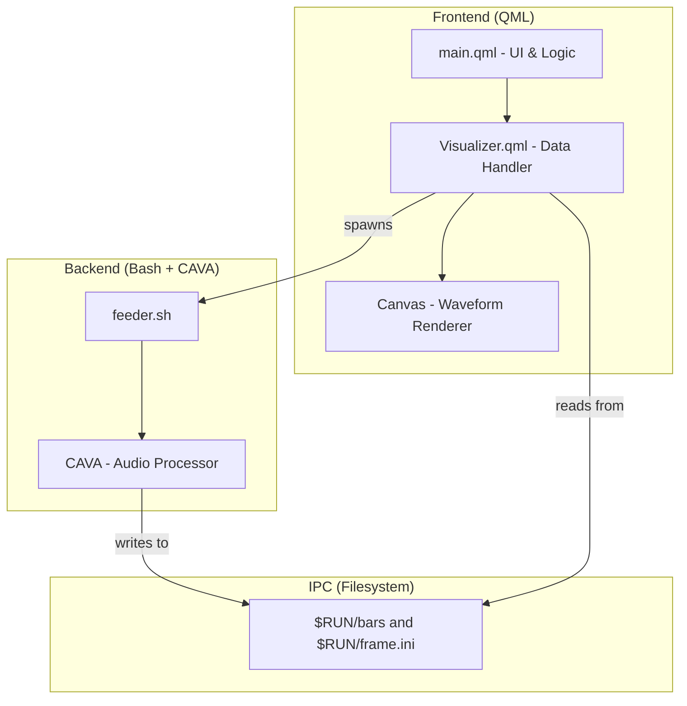
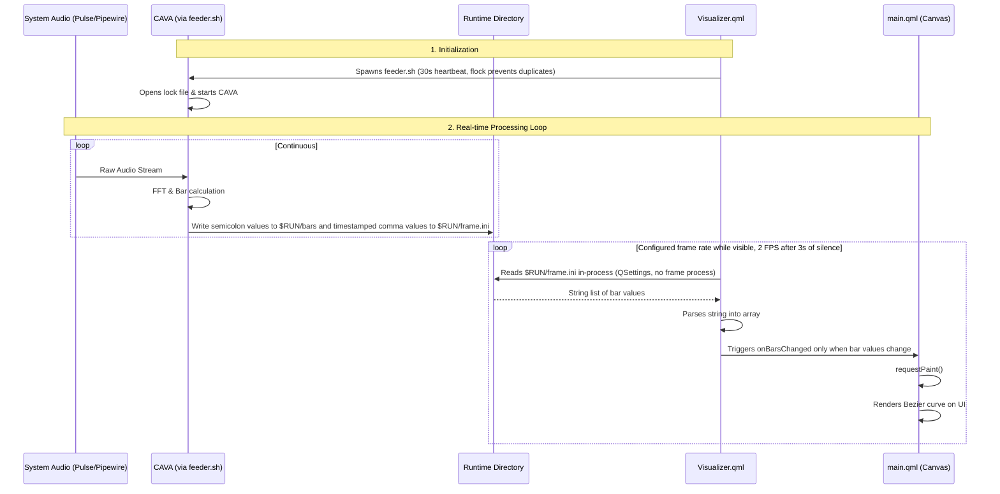

# Widget Workflow & Architecture

## Component Overview

The widget is split into three main layers: the **QML Frontend**, the **IPC Layer**, and the **Audio Backend**.

## Data Flow

The following sequence diagram shows how audio data moves from the system to your screen in real-time.

## Detailed Process breakdown

### 1. The Feeder (`feeder.sh`)
The feeder script acts as a bridge. It uses `cava` to process system audio and outputs raw data. It ensures only one instance of CAVA is running by using `flock`. `$RUN` is `${XDG_RUNTIME_DIR:-/tmp}/audio-wave-widget`.

`bars` keeps its original semicolon format for installed widgets. `frame.ini` holds
`t=<Unix time in seconds>` and `v=<comma-separated bars>` for in-process QSettings
reads. Both writes use Bash builtins. If the INI file is missing or its timestamp
is more than two seconds old, the reader falls back to the original `bars` file.
This lets old and new widgets share a feeder without forcing a restart on startup.
An old feeder still incurs the old executable-reader cost until it is replaced.

It also **probes input backends**. cava is compiled with a fixed set of them and distros do
not agree on which ones, so a hardcoded `method = pipewire` silently produces nothing on a
build without PipeWire support, or on a machine where the sound server is not reachable.
With the input method left on `auto` the feeder tries `pipewire`, `pulse`, then `alsa`, and
keeps the first one that emits a frame within `PROBE_TIMEOUT` seconds (cava emits frames
continuously even in silence, so "no output at all" is a reliable failure signal). The
winner is cached in `$RUN/input-method` so restarts skip the probe.

Two extra files make failures visible instead of silent:

| File | Contents |
|---|---|
| `$RUN/status` | `ok <method>`, `probing <method>`, or `error <code> [detail]` |
| `$RUN/cava.log` | cava's own stderr, for when the probe fails |

Error codes: `no-cava` (binary missing), `no-backend` (every candidate failed),
`cava-exited` (a working backend died — usually transient).

`no-cava` carries a third token naming the detected package manager (`apt-get`, `pacman`,
`nix-env`, …) so the widget can print the exact install command rather than "install cava".
Detection is by binary presence, not the `/etc/os-release` ID: derivatives keep their
parent's package manager but change the ID.

### 2. The Data Handler (`Visualizer.qml`)
This component is responsible for:
- Starting the feeder script.
- Periodically reading the bars data from the filesystem.
- Following actual audio independently of MPRIS playback state. Capture stays
  available so audio from apps without media controls can wake the wave.
- Polling at 2 FPS after sustained silence and snapping settled values to zero;
  repeated silent frames do not emit `barsChanged` or repaint the canvas.
- Polling `$RUN/status` every 4s and exposing `backendFailed` / `backendMessage` /
  `backendHint`, which `main.qml` renders in place of the waveform. A `cava-exited` state
  triggers an immediate respawn (the `flock` makes a redundant spawn a no-op) and is only
  reported to the user if it persists for ~12s.
- Restarting the feeder when a setting changes: it stops the feeder by the PID in
  `$RUN/feeder.pid` (and cava, for older feeders), waits for the `flock` to be
  released, then spawns the new one. Stopping only cava is not enough: during a
  backend probe the feeder would move on to the next backend with the old settings.
- Cleaning up the feeder process when the widget is destroyed.

### 3. The Renderer (`main.qml`)
The UI uses the HTML5-like `Canvas` API in QML to draw the selected visualizer from
the configured number of frequency bars. The idle line follows `vis.hasAudio`;
MPRIS only controls track information and media controls. The waveform seekbar
repaints when its playhead crosses a pixel or appears/disappears at an endpoint.

## Regression checks

Run `python3 tests/run.py` with Qt 6 `qmltestrunner` on `PATH`. The tests use the real
feeder with a synthetic cava process in an isolated runtime directory, and the
actual QML data handler with a stub executable engine. They cover changing INI
frames, legacy compatibility and stale-file fallback, silence settling and wakeup,
joining an existing feeder, and a restart during a backend probe applying the new
settings. They do not access the desktop or sound server. CI runs them in
`.github/workflows/tests.yml` via `nix develop --command python3 tests/run.py`.
